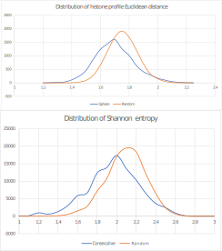

---  
title: Segmentation of the *Sacharomyces cerevisiae* genome based on sparse genomic, expression
  and epigenetic data
output:
  html_document:
    toc: yes
  bookdown::pdf_book: default
  pdf_document:
    toc: yes
  word_document:
    toc: yes
---


```{r, results="hide", message=FALSE, warning=FALSE, fig.show="hide", echo=FALSE}

# Enable / disable interactive figures
ENABLE_INTERACTIVE_FIGURES = TRUE


library(plotly)
library(RSQLite)
library(ggplot2)
library(reticulate)
library(gplots)
library(RColorBrewer)

# Title in Greek (I'm going to forget this if I don't write it somewhere):
# Μέθοδοι Τμηματοποίησης (Segmentation) Ευκαρυωτικών γονιδιωμάτων με βάση αραιά (sparse) γονιδιωματικά δεδομένα έκφρασης (RNASeq) και επιγενετικης.
```

# Abstract

In this work, we explore the budding yeast genome with the intention of identifying areas of local similarity against certain characteristics. We utilize such characteristics (collectively referred to as "signals") as histone modification profiles, transcription factor binding motifs, gene coexpression patterns and sequence conservation. These signals are sparsely sampled over the genome, at a resolution of one sample per gene. We consider signal locality in both one- and three-dimensional space and uncover a number of locally similar gene sets. Pairwise gene coexpression score signal yield a complete compartmentalization of the three-dimensional genome. The greater compartment is of particular interest; it is characterized by a lower than average coexpression score and enriched in genes related to metabolic pathways. In addition to this natural compartmentalization, we define a second, artificial one, based on the particular geometry of the yeast genome. Certain histone modification and transcription factor motif profiles are found to be localized in compact areas in three-dimensional space. For histone modification profiles in particular, this tendency of local convergence is prevalent at the finer scale of a few successive genes. Numerous small gene communities of strong histone profile affinity are scattered throughout the genome, generally having one of a few distinct histone modification profiles. We evaluate the corresponding gene sets with respect to gene duplication (separately for small-scale and whole-genome gene duplicates) enrichment, ontology enrichment and their topology in terms of the aforementioned compartmentalization schemas. 

In conclusion, the yeast genome seems to be organized in extended regions of subtle, yet significant similarity. Furthermore, this organization traverses various levels that include regulation, epigenetic state and conservation, as locally similar sets of genes extracted by one signal are frequently associated with sets extracted by another. These results hint at the possibility of an overarching, underlying genome structure. Further study, utilizing different types of signals is therefore encouraged. To this end, we propose a general-purpose algorithm that carries out such locality searches. The algorithm makes no assumption of the underlying signal distribution and requires a minimal configuration in order to adapt to a different kind of signal and thus facilitate future searches.

# Introduction

Recent advances in chromosome conformation capture (3C) techniques have provided insight into the spatial configuration of DNA (de Wit & de Laat, 2012). The fact that such configurations are predictably reproducible (Dixon et al., 2012) suggests that there exist an underlying structure in all eukaryote genomes. Additional studies that focus on similarities of gene expression in the linear dimension (Nikolaou, 2018; Tsochatzidou et al., 2017) indicate that genes have a preferred placement with respect to one another, which might reflect the presence of this underlying structure. Tsochatzidou et al. (2017) extract a number of topologically co-regulated gene clusters of the yeast genome, from their response to stress (induced by thermal deactivation of DNA topoisomerase II). Clusters that are down-regulated as a response to stress are located in cenntromeric, gene-dense regions, while those that are up-regulated are in the nuclear periphery. Nikolaou (2018) extracts topologically associated domains by applying a simple boundary-calling criterion on the raw 3C data. These domains are subsequently clustered into 6+1 classes by hierarchical clustering of their nucleosomal density distribution around the transcription start site. These classes vary significantly in conservation, size and distance from centromeres.

This study aims to collect and document additional evidence of a possible spatial structure of the eukaryotic genome. We focus on *Sacharomyces cerevisiae*, and, building on the already known (Duan et al., 2010) preferred spatial organization of its genome, we search for areas where a particular property is significantly localized. We utilize multiple such properties, ranging from epigenetic (histone) modifications and functional information (as is the tendency of certain gene pairs to co-express) to innate properties of the DNA sequence itself (such as, the presence or absence of a particular transcription factor binding site) and information about gene origin (gene duplication and conservation). These properties are henceforth referred to as "signals."

The primary question under research is whether or not *S. cerevisiae* genes of similar properties tend to co-localize. If they do, our secondary question is whether or not they have more things in common besides that.

We consider small sets of neighboring genes and assess the local signal distribution of this area. Then, by comparing it to the global distribution we extract gene sets of a particular tendency regarding each signal. 

The outcome of this process is a number of gene sets. As a convention, we will refer to these as "segments," when considering successive genes on a particular chromosome, "clusters" when the genes form a local neighborhood in three-dimensional space, and "compartments," when multiple, non-overlapping gene sets collectively account for the entire genome.

We subsequently annotate the extracted gene sets using information from the literature as well as the spatial relationship with each other.

We conclude that, there indeed exists a tendency of local accumulation of characteristics, whose extent varies depending on the signal under examination. Gene coexpression, for instance, is almost universally reaching its extreme score values when sets of nearby genes are considered. The entire genome is thus compartmentalized into areas of low and high coexpression. To a lesser extent, promoter-site histone modification profiles produce similar local features -however not covering the entire genome- bearing a strong correlation to the aforementioned compartments. A smaller collection of similar gene sets is produced by examining transcription factor binding motifs, again having a very particular placement with respect to the genome's spatial features.


# Materials and Methods

All of the signals we used were sparsely sampled over the genome, at a resolution of one sample per gene.

Pairwise gene coexpression score signal, henceforth called the "coexpression" signal was taken from (MacIsaac et al., 2006) and is a sparse matrix assigning a greater score to gene pairs which are found to co-express more.

Promoter-site histone modification profile signal, or the "histone profile" signal for short, comes from (Cheng et al., 2011) and is a z-score normalization of the relative abundance of the various histone variants near the promoter site of each gene.

Transcription factor binding motif signal (the "motif" signal), taken from (Harbison et al., 2004), assigns a binary vector to each gene, which corresponds to the gene's combination of presence or absence of a set of transcription factor binding sites. We consider a binding site as present when the corresponding motif appears.

The "duplication" signal (Fares et al., 2013) classifies each gene as duplicated or not. We further distinguish between "small scale" and "whole genome" duplication events ("SSD" and "WGD," respectively).

For the "conservation" signal, we use the average phastCons score (Siepel et al., 2005) which assigns to each gene, a count of related species where the gene is present; it effectively is a conservation index. The "taxon" signal links each gene to its maximal-level taxon ("Fungi" would signify a gene shared among all species of the kingdom, while *"S. cerevieiae"* marks species-exclusive genes).

Finally, we leverage the three-dimensional model of the yeast genome, published by (Duan et al., 2010) to place the aforementioned signals in space.


```{r, message=FALSE, warning=FALSE, fig.show="show", echo=FALSE}
conn <- dbConnect(RSQLite::SQLite(), "../Results/yeast.sqlite")
duplicateGenes <- dbGetQuery(conn, "SELECT l.Gene, x, y, z, CASE WHEN Category IS NULL THEN 'None' ELSE Category END AS Category FROM Loci l LEFT JOIN GeneDuplication d ON l.Gene = d.Gene")
if (ENABLE_INTERACTIVE_FIGURES) {
	plot_ly(x=duplicateGenes$x, y=duplicateGenes$y, z=duplicateGenes$z, type="scatter3d", mode="markers", text=duplicateGenes$Gene, color=duplicateGenes$Category)
}
dbDisconnect(conn)
```

`r if(!ENABLE_INTERACTIVE_FIGURES){""}`

<font size="1">
**Figure 1:** Gene duplication signal mapped to three-dimensional space.
</font>

## Pre-processing

Pairwise gene coexpression score is partially defined. Only the top scores for each gene are included. We assume the rest of the scores to be zero, which is not an over-simplification, given the distribution of scores present in the input data files. The distribution fully outlines a normal distribution down to its minimal p-value tails which means that missing values are indeed negligible. We further process the dataset by losslessly compressing it to one byte per score, thus allowing for the subsequent complex computation. The interested reader is referred to the accompanying documentation, where a full reference of data flow may be found.

The histone profile signal is less dense than our desired per-gene resolution. However, for certain histone variants we have per-gene information. We only keep these histone variants (namely: H3K4, H3K6, H3NTerm, H4NTerm, H2A, H2B, H3, H4 and H2AZ). This yields a 9-dimensional vector assigned to each gene. We consider the associated 9-dimensional space and its Euclidean distance as a measure of histone profile dissimilarity. Occassional missing values are imputated as the median of the 3 nearest genes in the histone profile space.

{width='40%'}

<font size="1">
**Figure 2:** Resampling of the Duan et al. model by linear interpolation. The center base pair (C) of each gene is found between two successive control points (A and B) of the source model. A weighed average of these two points is assigned as the position of the gene in space.
</font>

The three-dimensional model of the yeast genome (Duan et al., 2010) has been resampled at gene resolution. The input dataset is of adequate (kilobase) resolution to represent genes in space. We obtained gene positions by linearly interpolating the model's control points to approximate the center base pair of each gene. We assumed uniform sampling for this (see "Assumptions").

## Sphere test

We use the same algorithm to detect local similarity in all aforementioned signals. It is a reusable algorithm and it may be adapted to any kind of signal, when equipped with an appropriate summary function, or "metric". For each local set of genes under consideration, we calculate the metric, which is a real number characterizing the set of genes. We pick the metric in such a way that, extreme values of the metric correspond to extreme similarity. Subsequently statistical significance of the extreme values is determined by randomly sampling gene sets and calculating the same metric. Thus, the algorithm is agnostic to underlying signal distribution and may be generalized for a multitude of signal types.

{width='60%'}

<font size="1">
**Figure 3:** Sphere-test data flow.
</font>

We start by sampling a set of genes that form a local group. We achieve this by randomly placing a sphere of pre-determined radius in the three-dimensional space of the genome model. Genes that happen to lie within the sphere are collected and form a sample. We limit the minimum size of acceptable samples to roughly one third of the maximum sample size. We generally use sphere-samples of 50-150 genes.

Once a local sample is defined, we then calculate the metric over the sampled gene set and extract a p-value by repeatedly calculating the same metric for a number (usually 10000) of random samples of the same gene count, picked from the entire genome.

Repeating this procedure multiple times, we cover the entire genome with random spheres, each associated with a p-value. We filter these spheres for a FDR of 1% or (in the case of "motif" signal) 5%.

The resulting significant spheres are then hierarchically clustered by overlap. We define sphere overlap as the count of shared genes divided by the minimum count of genes in the pair of spheres. The pair of spheres overlapping the most, forms a cluster as the union of the gene sets. The recursion stops at a minimum overlap of 5%, at which point we consider the clusters as distinct.

### Metrics used

As a summary function, or "metric", we define any function whose domain is a set of genes and its value is a real number. By "metric" we shall refer to both the function itself and its value. The latter will always be in the context of a given gene set G.

$m = M(G)$

<font size="1">
**Equation 1:** General form of the metric function (M). It assigns a real value (m) to any set of genes (G).
</font>

For the *coexpression* signal, the metric function begins by enumerating all possible ordered pairs of genes in G (see Equation 1). The coexpression signal defines a coexpression score for each of the pairs. M is the average of all scores. A greater value of this metric signifies a sphere of genes that coexpress more.

For the *histone profile* signal, we define M to be the average Eucliden distance of all unordered pairs within set G. We use unordered pairs as Euclidean distance is symmetric. As we noted earlier, Euclidean distance in histone space is a measure of dissimilarity, so an extreme low value of this metric signifies a sphere of genes having similar histone modification profiles.

In the same fashion, Jaccard distance is used as a metric for the *motif* signal. Jaccard is a distance metric, which (like Euclidean distance) signifies dissimilarity. Low values of this metric characterize gene sets having similar transcription factor binding sites.

*Gene duplication* is a categorical signal. It assigns one of the categories "None," "SSD" or "WGD" to each gene. Of course, a sphere containing only one of these categories (for instance a sphere of purely non-duplicated genes) is interesting. To a lesser extent, a sphere of mostly one category is interesting too. We formulate the prevalence of one category using the Sannon entropy of set G. Low values of this metric signify a more prevalent category.

Regarding the *species count* signal, we are interested in finding gene sets of similar conservation index (which in this case is species count), so the standard deviation of species count within G is used. A set of genes (G) will be deemed interesting when most of its genes are conserved or most are not. In both cases there is a low variance in species count.

The *taxon* signal is also categorical. Instead of reusing the Shannon entropy metric (which we applied to gene duplication signal), for this one we consider enrichment of the taxa. Enrichment is defined as $observed / expected$, where "observed" is the ratio of genes of set G in the given taxon, and "expected" is the ratio of the taxon in the entire genome. This signal is dominated by the "Fungi" taxon, so gene sets consisting mostly of "Fungi" genes are not of particular interest. On the other hand, gene sets extremely over- or under-representing a taxon are. We compute the natural logarithm of enrichment of all categories present in G, which makes over- and under-representation comparable, and we get the absolute value of this logarithm, which makes under-representations yield the same metric as over-representations of equal magnitude. Finally, we summarize all these absolute logarithmic enrichments (one for each taxon present in G) by keeping the maximum among them, which becomes our metric. A great value of this metric signifies a set of genes having a significant over- or under-representation of one of the taxa.


The following table summarizes the metric used for each sphere test.

| Signal            | Metric
|-------------------|---------------------------------------------------------------------------------|
| Coexpression      | Average coexpression score of all ordered pairs in gene set                     |
| Histone profile   | Average histone-profile space Euclidean distance of all ordered gene pairs      |
| Motif             | Average Jaccard distance of all ordered pairs of genes                          |
| Gene duplication  | Shannon entropy of the duplication categories "None," "SSD," "WGD" in gene set  |
| Species count     | Standard deviation of species count in gene set                                 |
| Taxon             | Maximum absolute logarithmic enrichment of all taxa present in the set          |

<font size="1">
**Table 1:** Signals used and respective statistics computed.
</font>

## Small scale analysis of histone modification profiles

We additionally perform a finer scale analysis for the histone profile signal in particular. In this analysis, locality is considered in terms of position in the chromosome (*linear* or *index* space). We measure the average histone profile space Euclidean distance in groups of 5 consecutive genes. The average histone profile space distance of the middle gene of the group to all other genes in the chromosome is then divided by the local average distance to yield a "community score." 

{width='60%'}

<font size="1">
**Figure 4:** Distribution of histone-profile average in-group Euclidean distance (top) and distribution of histone profile class Shannon entropy (bottom) of local gene sets (clusters and segments, respectively) in contrast to distribution of the same quantity in random samples of the same gene count. Both are characterized by a shift towards smaller values, which signifies a tendency of similar histone modification profiles to co-localize in space.
</font>


A greater community score signifies a local group possessing a greater in-group similarity than its similarity to the rest of the genome, hence the name. As a first approcimation, we consider a community score of 2 as significant (local similarity is twice as strong as global). Filtering the genes using this threshold results in a number of genes forming local communities around them. These genes are scattered throughout the entire genome.

```{r warning=FALSE, echo=FALSE, out.width="60%"}
## Genes selected for being community-centers
sql <- "SELECT h.* FROM HistonesPromoterPatched h JOIN CommunityScores s ON h.Gene = s.Gene WHERE Score >= 2"
conn <- dbConnect(RSQLite::SQLite(), "../Results/yeast.sqlite")
centers <- dbGetQuery(conn, sql)
row.names(centers) <- centers$Gene
centers <- centers[,names(centers) != "Gene"]
centers <- as.matrix(centers)
dbDisconnect(conn)

maxClusterCount <- 10
withinSS <- sapply(1:maxClusterCount, 
              function(k){kmeans(centers, k, nstart=50,iter.max = 20 )$tot.withinss})
plot(1:maxClusterCount, withinSS,
     type="b", pch = 19, frame = FALSE, 
     xlab="Cluster count",
     ylab="Within-clusters total sum of squares")
 
```

<font size="1">
**Figure 5:** Within-cluster variance as a function of cluster count. No abrupt drop in variance can be found, which makes it impractical to select a cluster count via the "elbow" method. We resort to x-means, which optimizes the Bayesian information criterion. Under this criterion, a model of 7 clusters best explains the data.
</font>

X-means (Pelleg & Moore, 2000) clustering of these community-center genes supports the presence of 7 characteristic histone modification profiles. In order to incorporate the significance of locality (which is our main concern in this study), we classify all genes in these 7 classes. We do so by k-nearest neighbors classification, with a k value of 3.

Having assigned a histone profile class to each gene, where the classes are known to form local communities, we then filter all chromosomes by a sliding window of 25 consecutive genes. We measure Shannon entropy in terms of the 7 classes. The distribution of Shannon entropy in sliding windows is both multimodal and displaced (see Figure 1) compared to the distribution of randomly picked sets of 25 genes.

We filter the sliding windows, keeping those of a p-value less than 0.1%. This corresponds to approximately 1.28 bits of entropy per window and aims to capture the left-most mode of the distribution. By connecting the overlapping windows we get a number of segments having a tighter than usual histone modification profile.

## Annotation

We annotate the resulting segments, clusters and compartments by both gene ontology term enrichment analysis (carried out via g:Profiler) and by cross examination of the gene sets against each other. This is achieved by an automated program which calculates overlaps between all pairs of gene sets and reports significant overlaps. Furthermore, we examine signals not yielding significant gene sets in the vicinity of the gene sets coming from signals which do. Our findings are summarized in the next section.

Please refer to the accompanying documentation for a complete technical reference.

# Results 

This section is organized by gene set size. We start with the larger compartments, then progress with clusters and finally, we present the much smaller segments.

## Compartments

We provide two compartmentalizations of the yeast genome. The first one is an arbitrary segmentation of the visible features of the genome; useful as a reference to a gene set's location by name. The second additionally serves the same purpose (assigning descriptive and easy to memorize names to various areas of the genome) while at the same time its areas exhibit local similarity in terms of gene coexpression score signal.

### Rough features

Three distinguished features can be easily extracted by mere visual inspection of the model. We call these the "Hat," "Internal" and "External" compartments.
The Hat is a domain formed by chromosome XII. It contains multiple rDNA repetitions and acts as an insulator between the nucleolus and the rest of the chromosomes (Duan et al., 2010). What remains besides the Hat, is an approximately spherical construct, which follows the Rabl configuration (Pouokam et al., 2019) and is hollow. The set of genes closer than average to its centroid are annotated as "Internal" and the rest as "External."


```{r, message=FALSE, warning=FALSE, fig.show="show", echo=FALSE}
conn <- dbConnect(RSQLite::SQLite(), "../Results/yeast.sqlite")
genePositionsLabels <- dbGetQuery(conn, "SELECT Loci.Gene, x, y, z, Label FROM
Loci JOIN RoughFeatures ON Loci.Gene = RoughFeatures.Gene")
if (ENABLE_INTERACTIVE_FIGURES) {
	plot_ly(x=genePositionsLabels$x, y=genePositionsLabels$y, z=genePositionsLabels$z, type="scatter3d", mode="markers", text=genePositionsLabels$Gene, color=genePositionsLabels$Label)
}
dbDisconnect(conn)
```
`r if(!ENABLE_INTERACTIVE_FIGURES){""}`

<font size="1">
**Figure 6:** Rough features of *S. cerevisiae* genome.
</font>

### Continents

Alongside this arbitrary compartmentalization, our sphere-test analysis of coexpression signal outlines a second set of distinct compartments. It is the norm that a sphere-sample of genes exceeds the coexpression score of a random set of the same gene count. In other words, coexpression is strongly associated with co-localization. We filter the sphere samples for a 1% false discovery rate and this results in 7 clusters of high coexpression score.

Boundaries between these clusters are not always clear. Furthermore, with the exception of a single cluster, combining these together does not have a very significant effect on the average coexpression score. So, this is really a distinction between high and low coexpression areas of the genome. An exceptional cluster has a slightly raised coexpression score (even compared to the other high-coexpression clusters) comprises the centromeres which converge on one pole of the genome. We therefore name this cluster "Antarctica," as a reminder of its special location and synthesis.

The remaining clusters have an unaffected coexpression score, regardless of the way we combine them. Following our continent-naming scheme, we combine the clusters found at opposite sides of the genome as "Laurasia" (which is the larger) and "Godwana."

The rest of the genome which is characterized by a lower than average coexpression score forms a distinct vertical (parallel to the line connecting the centromeric and telomeric pole) barrier between these "continents" of intense coexpression and is therefore named "Tethys." The barrier extends to the Hat region as well, also splitting it in half.

```{r, message=FALSE, warning=FALSE, fig.show="show", echo=FALSE}
sql <- "SELECT l.*, Continent FROM Loci l JOIN Continents c ON l.Gene = c.Gene"
fieldColors <- c("#FF0000", "#00FF00", "#0000FF", "#FFFF00", "#00FFFF", "#4488AA", "#FF00FF", "#000000")
conn <- dbConnect(RSQLite::SQLite(), "../Results/yeast.sqlite")
continents <- dbGetQuery(conn, sql)
if (ENABLE_INTERACTIVE_FIGURES) {
	plot_ly(x=continents$x, y=continents$y, z=continents$z, type="scatter3d", mode="markers", text=continents$Gene, color=continents$Continent, colors=fieldColors)
}
dbDisconnect(conn)
```

`r if(!ENABLE_INTERACTIVE_FIGURES){""}`

<font size="1">
**Figure 7:** Continent-inspired compartmentalization of the yeast genome. The primary distinction is between areas of high (land) and low (sea) coexpression scores.
</font>

The box plot below shows the distribution of coexpression score within the compartments as compared to the entire genome ("Random" category).

```{r, message=FALSE, warning=FALSE, fig.show="show", echo=FALSE, out.width="60%"}
continentCoexpression <- read.table(file = '../Results/ContinentCoexpressionScoreSamples.tsv', sep = '\t', header = TRUE)
boxplot(continentCoexpression, outline=FALSE, las=2, main="Pairwise coexpression score")
```

<font size="1">
**Figure 8:** Box plot of average coexpression score between all ordered gene pairs of each continent compartment. The low coexpression score compartment (Tethys) is below average (Random, which is the global average of all possible gene pairs), while "land" compartments (Laurasia, Godwana, Antarctica) are above average.
</font>

Mean coexpression score is greater than average in "land" while lower than average in "sea." A t-test verifies that these mean shifts are statistically significant.

| Compartment  | p-value   |
|-------------|-------------------------|
| Godwana     | $1.18\times 10^{-16}$   |
| Antarctica  | $1.03\times 10^{-25}$   |
| Laurasia    | $7.02\times 10^{-09}$   |
| Tethys      | $1.15\times 10^{-54}$   |
| Pangaea     | $7.85\times 10^{-14}$   |

<font size="1">
**Table 2:** Statistical significance of the difference in coexpression between each of the compartments and the entire genome. A combination of all high-coexpression compartments, named Pangaea, maintains statistical significance against the whole genome.
</font>

The large compartment of low coexpression (Tethys) is enriched in "Metabolic pathways" genes (KEGG:01100), with an adjusted p-value of 2.0%. Less significant enrichments are found as well. *Rap1* in particular, is a transcription factor that is associated with telomeres. The prevalence of genes with variable expression in telomeric regions has been hinted at in related works (Tsochatzidou et al., 2017).


<font size="1">
**Figure 9:** g:Profiler ontology enrichment results for Tethys compartment.
</font>

While Antarctica shows no particular preference over any type of gene duplication, the greater high-coexpression compartments are enriched in WGD genes while the low-coexpression compartment is negatively enriched in WGD.

|Continent |Gene count|SSD |SSD ratio|SSD enrichment|WGD |WGD ratio|WGD enrichment|
|----------|----------|----|---------|--------------|----|---------|--------------|
|Antarctica|417       |65  |0.156    |1.012         |71  |0.170    |1.015         |
|Godwana   |1026      |159 |0.155    |1.006         |204 |0.199    |1.185         |
|Laurasia  |2266      |345 |0.152    |0.988         |431 |0.190    |1.134         |
|Tethys    |2787      |414 |0.149    |0.964         |361 |0.130    |0.772         |

<font size="1">
**Table 3:** Enrichment in "whole genome" (WGD) and "small scale" (SSD) duplicated genes in each of the continent compartments.
</font>

## Clusters

Smaller areas of significant local similarity were found by examining the histone profile and motif signals.

### Histone profile clusters

Seven smaller, completely isolated clusters have a more compact histone profile than expected by chance. We label these clusters with the letters A to G, ordering them in ascending size.

```{r, message=FALSE, warning=FALSE, fig.show="show", echo=FALSE}
sql <- "SELECT l.*, CASE WHEN Field IS NULL THEN 'None' ELSE Field END AS Field FROM Loci l LEFT JOIN PromoterFields f ON l.Gene = f.Gene"
fieldColors <- c("#FF0000", "#00FF00", "#0000FF", "#FFFF00", "#00FFFF", "#4488AA", "#FF00FF", "#000000")
conn <- dbConnect(RSQLite::SQLite(), "../Results/yeast.sqlite")
promoterFields <- dbGetQuery(conn, sql)
if (ENABLE_INTERACTIVE_FIGURES) {
	plot_ly(x=promoterFields$x, y=promoterFields$y, z=promoterFields$z, type="scatter3d", mode="markers", text=promoterFields$Gene, color=promoterFields$Field, colors=fieldColors)
}
dbDisconnect(conn)
```

`r if(!ENABLE_INTERACTIVE_FIGURES){""}`

<font size="1">
**Figure 10:** Histone profile clusters. Collections of genes having a lower than average (adjusted p-value less than 1%) variance in histone modification profile than average. Each of these clusters has a unique histone modification profile.
</font>

Six out of the seven clusters lie mostly or entirely within the bounds of the two large continent clusters described in the previous section.

| Cluster   | Continent  | Common gene count    | Overlap ratio   |
|-----------|------------|----------------------|-----------------|
|A          |Laurasia    |62                    |1.00             |
|B          |Laurasia    |116                   |0.97             |
|F          |Laurasia    |192                   |0.89             |
|C          |Godwana     |120                   |1.00             |
|D          |Godwana     |160                   |1.00             |
|G          |Godwana     |218                   |0.96             |

<font size="1">
**Table 4:** Overlap of histone profile clusters with the continent compartments. Clusters of local similarity regarding histone modification profiles have a strong preference towards "land" compartments, which in turn are characterized by increased coexpression and enrichment in WGD genes.
</font>


It follows that these clusters of particular promoter-site histone modification profiles lie almost exclusively in areas of high coexpression. Three of these clusters are on one side of the coexpression insulator and three on the other.

Cluster E presents an exception as it is split roughly in half between Tethys and Laurasia.

Each of the seven clusters has its own particular histone modification profile. Displacement from the mean is subtle. However each particular cluster moves as a whole to the same direction in each dimension (corresponding to a particular histone variant), which renders the group statistically significant.

Furthermore, the shift appears to be quantized as evidenced by the multimodal distribution of shifts. Each cluster appears to consistently over- or under-represent a particular histone variant in one or two of its promoter-site nucleosomes.

```{r, message=FALSE, warning=FALSE, fig.show="show", echo=FALSE, out.width="60%"}
colors <- c("#FF0000", "#FF0000", "#000000", "#00FF00", "#00FF00")
colors <- colorRampPalette(colors)(25)

tendencies <- read.table(
  "../Results/PromoterFieldsTendencies.tsv",
  sep="\t", header=TRUE, row.names=1)
tendenciesScaled <- scale(tendencies)
heatmap.2(tendenciesScaled, col=colors, main="Shifts in histone variant abundance")
```

<font size="1">
**Figure 11:** Heatmap visualization and hierarchical clustering of shifts in histone variant abundance for each cluster. Over-representation of a particular histone variant is colored in green, under-representation in red. Notice the gap between over- and under-representation. All locally similar clusters are shifted in all 9 dimensions with a quantized (step-wise) shift.
</font>

The larger among these clusters produce gene ontology enrichments.

| Cluster  | Term                                | PAdj |
|----------|--------------------------------------|------|
| D        | Terpenoid backbone biosynthesis      | 4%   |
| E        | Ribosomal small subunit binding      | 5%   |
| F        | Factor: HSF; motif: AGAANAGAANAGAAN  | 2%   |
| G        | Factor: HSF; motif: NTTCTAGAANAGAAN  | 1%   |

<font size="1">
**Table 5:** Enriched gene ontology terms found in histone profile clusters.
</font>

The smaller 4 clusters follow the same trend found in continents, of over-representing WGD genes.


|Cluster|Gene count|SSD|SSD ratio|SSD enrichment|WGD|WGD ratio|WGD enrichment|
|-------|----------|---|---------|--------------|---|---------|--------------|
|A      |62        |7  |0.11     |0.73          |13 |0.21     |1.25          |
|B      |119       |17 |0.14     |0.93          |25 |0.21     |1.25          |
|C      |120       |21 |0.18     |1.14          |24 |0.20     |1.19          |
|D      |160       |23 |0.14     |0.93          |36 |0.23     |1.34          |
|E      |173       |29 |0.17     |1.09          |28 |0.16     |0.96          |
|F      |216       |29 |0.13     |0.87          |26 |0.12     |0.72          |
|G      |226       |43 |0.19     |1.23          |38 |0.17     |1.00          |


<font size="1">
**Table 6:** Enrichments in SSD and WGD per histone profile cluster. 
</font>

### Motif clusters

For the transcription factor binding motif signal, we used a two-tailed test, which resulted in 4 clusters, the smaller of which (labeled "A") has a more varied motif profile than expected by chance. The remaining three have a more compact profile.

In contrast to histone modification profiles, motif profiles tend to be more randomly dispersed throughout the genome. We thus used a less strict FDR of 5% for this test.

Cluster A, which has an unusually varied motif profile, almost completely (96% overlap) lies within the Tethys compartment, of low coexpression, placed in the small gap between Godwana and Eurasia in the Hat region, tracing the boundaries of these continents without overlapping with them. We find this fact remarkable, as this cluster was found by examining a different signal than the one generating the continents.

In addition, cluster A produces a rich set of ontology associations. These are mostly related to a group of 4 genes associated with asparaginase activity (YLR160C,YLR158C,YLR155 and YLR157C).


<font size="1">
**Figure 12:** g:Profiler ontology results for Motif cluster A.
</font>

The rest of the clusters (B, C and D) are completely distinct from the histone profile clusters. They occupy a location near the centromeres, but without having a significant overlap neither with the nearby compartment of Antarctica, nor with any other compartment. They also produce a few term enrichments; most significant among them are summarized in the table below.

|Cluster|Term                                                           |Adjusted p-value|
|-------|---------------------------------------------------------------|----------------|
|B      |Factor: MAC1; motif: TTTGCTCAM                                 |1.3%            |
|C      |regulation of attachment of spindle microtubules to kinetochore|0.9%            |
|D      |Factor: GCR2; motif: GCTTCCN                                   |1.0%            |

<font size="1">
**Table 7:** Gene ontology enrichments per motif cluster.
</font>

## Segments

Histone modification profiles tend to form small communities of a few consecutive genes. These communities become apparent in a heatmap rendering of histone-modification space Euclidean distances between all genes of a chromosome.

```{r, warning=FALSE, echo=FALSE}
colors <- c("#000000", "#FF0000", "#FF00FF")
colors <- colorRampPalette(colors)(25)

# Keep a table of genes and their 'uniqueness' value
uniqueness <- c()

plotChromosome <- function(chromosome) {
	# Prepare SQL to get data from a single chromosome
	whereClause <- paste("WHERE Chromosome = ", chromosome)
	sql <- paste("SELECT h.* FROM HistonesPromoterPatched h JOIN Loci ON h.Gene = Loci.Gene ", whereClause, " ORDER BY Chromosome, Start")

	# Get data
	conn <- dbConnect(RSQLite::SQLite(), "../Results/yeast.sqlite")
	histones <- dbGetQuery(conn, sql)
	row.names(histones) <- histones$Gene
	histones <- histones[,names(histones) != "Gene"]
	dbDisconnect(conn)

	# Plot
	distanceMatrix <- dist(histones)
	distanceMatrix <- as.matrix(distanceMatrix)
	title <- paste("Chromosome ", chromosome)
	heatmap.2(distanceMatrix, main=title, dendrogram='none', Rowv=FALSE, Colv=FALSE,trace='none', col=colors)
}

#for (chromosome in 1:16) {
#	plotChromosome(chromosome)
#}

plotChromosome(3)
```

<font size="1">
**Figure 13:** Heatmap visualization of histone profile space Euclidean distance between all pairs of genes in chromosome III. Small communities of very similar histone profiles can be seen along the diagonal, as black rectangles.
</font>

These communities are visible as black boxes along the diagonal, black corresponding to an approximately equal histone modification signal. We have found 203 such communities throughout the genome. Their placement does not seem to converge to any particular point in space.

We group each of the associated 203 histone modification profiles into 7 clusters, using x-means. This number of clusters optimizes the Bayesian information criterion (BIC). The resulting classes of histone profiles which are known to produce communities around them. Subsequently, we classify all genes into these 7 classes in order to explore the possibility of the classes themselves converging towards specific areas. Figure 1 shows the distribution of Shannon entropy in sliding windows and sets of random genes of the same size. The mean has moved to lower values which means that the classes indeed have a tendency to co-localize.

Divergence from average in histone variant abundance is not as subtle as in the case of histone profile clusters. Each of the 7 histone profiles has more pronounced differences from average, but not for all histone variants. This allows us to visualize the histone profiles using the original signal (instead of plotting tendencies). Figure 14 shows a heatmap visualization of these profiles. The distribution is bimodal, similar to the distribution of histone profile clusters, with the gap around zero meaning that these profiles distinguish themslves from average.

```{r, message=FALSE, warning=FALSE, fig.show="show", echo=FALSE, out.width="60%"}
colors <- c("#FF0000", "#FF0000", "#000000", "#00FF00", "#00FF00")
colors <- colorRampPalette(colors)(25)

tendencies <- read.table(
  "../Results/CommunityHistoneTendencies.tsv",
  sep="\t", header=TRUE, row.names=10)
tendencies <- as.matrix(tendencies)
heatmap.2(tendencies, col=colors, main="Histone variant abundance")
```

<font size="1">
**Figure 14:** Heatmap visualization and hierarchical clustering of histone variant abundance for each of the 7 histone profile classes.  Differences from average are more pronounced in the case of communities (in contrast to histone profile clusters), which allows us to plot the original signal, instead of the shifts from average.
</font>

We then filter the genes using a sliding window of 25 genes, and a threshold of 1.28 bits of entropy.


<font size="1">
**Figure 15:** Color encoding of histone class per gene. Each of the 7 histone classes is assigned a different color. Filtering by entropy uncovers segments of reduced histone profile variance.
</font>

The result is 12 small gene sets (407 genes in total), which we annotate using a combination of the latin numeral of the chromosome they are found in and an English letter suffix to denote the order in which they appear in the chromosome, when there exist more than one.

These segments are small and so we establish strict criteria for assessing the associated enrichments. We only consider enrichments where at least 5 genes appear in the term, otherwise enrichments with an adjusted p-value of less than 1%.

A few segments survive our criteria. Their enrichments are summarized as follows.

| Community		| Term												| Adjusted p-value  |
|---------------|---------------------------------------------------|-------------------|
| II			| acetyl-CoA transmembrane transporter activity		| 0.5%              |
| IV-A			| Factor: Gal4p, Factor: Gal4p, Factor: SWI4P		| 0.1%              |
| VII-B			| Factor: DAL81										| 0.1%              |
| X				| Factor: Mbp1p, Factor: ARG						| 2.6%              |

<font size="1">
**Table 8:** Gene ontology enrichments per histone profile community.
</font>

These segments have a slight preference to Internal compartment (273 genes) over the external (134 genes). Figure 16 shows a comparison of distances between genes picked from segments against that of randomly picked genes; the segments distribution is poor in large distances. The Hat compartment does not contain communities.

{width="50%"}

<font size="1">
**Figure 16:** Gene pair distance distribution. Comparison between gene pairs picked from the histone class entropy-filtered segments against randomly-picked gene pairs.
</font>

## Signals not yielding clusters

Gene duplication, species count and taxon signals do not converge in three-dimensional space.

# Discussion

The more evident example of co-localization is that of pair-wise gene coexpression score signal. Indeed, it is the norm that nearby genes coexpress more. However, there exists a clear distinction between compartments of high and low coexpression. The high coexpression compartment is enriched in genes coming from a "whole genome" duplication (WGD) event. It seems logical that duplicate genes coexpress more.
On the other hand, the low coexpression compartment (Tethys), is rich in genes having to do with metabolic pathways but not in duplicated genes. This is perhaps the result of a preferential selection against duplicated genes, because of particular stoichiometric and/or regulatory requirements of metabolism. Tethys splits the genome roughly in half, and the alignment of the splitting plane to the centromere-telomere axis is noteworthy.

Local condensations of post-translational promoter-site histone modification profiles show a strong preference towards the high-coexpression and WGD-rich (the "land") side of the genome. These clusters occupy unique spots in the 9-dimensional space of histone profiles. The difference in abundance of histone variants is subtle: possibly one or two nucleosomes of the promoter region account for the divergence from the average in each dimension. A more in-depth analysis, using higher-resolution data might uncover additional structure in the promoter region of these genes.

Neighboring genes with similar transcription factor motif profiles can be found near the centromeric pole. This proximity might not be trivial, in light of the fact that one of these clusters is associated with the kinetochore while placed in close proximity to it.
Among the various signals we took into consideration, the motif signal has the special property of having an area significantly more varied than expected by chance. This cluster is part of the Hat feature (see "Comparments" section) which is formed by chromosome XII. It is not negligible that this cluster exactly fits in the low-coexpression rim that bisects the Hat. 

At a finer scale, histone profiles form even more deistinct groups of around 5 genes. These communities are spread around the genome without forming a discernible pattern. Their histone modification profiles appear to fall into 7 catetgories, which themselves manifest a tendency to co-localize, accompanied by a preference to the Internal compartment of the genome. Further, high-resolution analysis of these communities and the associated profiles may also yield interesting results and is therefore encouraged.

In conclusion, both our research queries have been addressed. There indeed exists a tendency to form local groups of genes having similar genomic and epigenomic characteristics, in both index and three-dimensional space. The respective gene sets, on the other hand, have more in common than just the characteristic used to define them. In addition, it is not uncommon to find that gene sets produced by different signals are strict (or approximate) subsets of one another.

Having established these tendencies for spatial organization of the genome, further analysis is encouraged, possibly utilizing different kinds of signals. Our algorithm can be repurposed to accomodate any kind of signal, with the minimal configuration of specifying an appropriate statistic. Please refer to the complementary technical report for a complete specification and implementation of the algorithm.

# Acknowledgments


Dr. Christoforos Nikolaou is the supervisor of this work. He proposed the sphere-sampling algorithm and provided direction and prioritization of the various tests we carried out, as well as a plethora of insights on statistics, genome organization and writing. His contribution can not be overstated.

Athanasia Stavropoulou offered the transcription factor motif signal and insight regarding the resulting motif clusters, coming from her own work of training a hidden Markov model on the same dataset. In addition, she helped during debugging of parsing the coexpression dataset and took an active role in the creative process by both participating in the yeast-related weekly meetings and by constantly exchanging ideas and advice.

Nikos Vakirlis has provided the gene species count and overarching taxon per gene dataset.

CG2 team has contributed by critically discussing every aspact of this work.
	

# References

* Nikolaou, C. (2018). Invisible cities: Segregated domains in the yeast genome with distinct structural and functional attributes. Current Genetics, 64(1), 247–258. https://doi.org/10.1007/s00294-017-0731-6
* Tsochatzidou, M., Malliarou, M., Papanikolaou, N., Roca, J., & Nikolaou, C. (2017). Genome urbanization: Clusters of topologically co-regulated genes delineate functional compartments in the genome of Saccharomyces cerevisiae. Nucleic Acids Research, 45. https://doi.org/10.1093/nar/gkx198
* Cheng, C., Shou, C., Yip, K. Y., & Gerstein, M. B. (2011). Genome-wide analysis of chromatin features identifies histone modification sensitive and insensitive yeast transcription factors. Genome Biology, 12(11), R111. https://doi.org/10.1186/gb-2011-12-11-r111
* Fares, M. A., Keane, O. M., Toft, C., Carretero-Paulet, L., & Jones, G. W. (2013). The Roles of Whole-Genome and Small-Scale Duplications in the Functional Specialization of Saccharomyces cerevisiae Genes. PLoS Genetics, 9(1). https://doi.org/10.1371/journal.pgen.1003176
* Harbison, C. T., Gordon, D. B., Lee, T. I., Rinaldi, N. J., Macisaac, K. D., Danford, T. W., Hannett, N. M., Tagne, J.-B., Reynolds, D. B., Yoo, J., Jennings, E. G., Zeitlinger, J., Pokholok, D. K., Kellis, M., Rolfe, P. A., Takusagawa, K. T., Lander, E. S., Gifford, D. K., Fraenkel, E., & Young, R. A. (2004). Transcriptional regulatory code of a eukaryotic genome. Nature, 431(7004), 99–104. h* ttps://doi.org/10.1038/nature02800
* MacIsaac, K. D., Wang, T., Gordon, D. B., Gifford, D. K., Stormo, G. D., & Fraenkel, E. (2006). An improved map of conserved regulatory sites for Saccharomyces cerevisiae. BMC Bioinformatics, 7, 113. https://doi.org/10.1186/1471-2105-7-113
* Siepel, A., Bejerano, G., Pedersen, J. S., Hinrichs, A. S., Hou, M., Rosenbloom, K., Clawson, H., Spieth, J., Hillier, L. W., Richards, S., Weinstock, G. M., Wilson, R. K., Gibbs, R. A., Kent, W. J., Miller, W., & Haussler, D. (2005). Evolutionarily conserved elements in vertebrate, insect, worm, and yeast genomes. Genome Research, 15(8), 1034–1050. https://doi.org/10.1101/gr.3715005
* de Wit, E., & de Laat, W. (2012). A decade of 3C technologies: Insights into nuclear organization. Genes & Development, 26(1), 11–24. https://doi.org/10.1101/gad.179804.111
* Dixon, J. R., Selvaraj, S., Yue, F., Kim, A., Li, Y., Shen, Y., Hu, M., Liu, J. S., & Ren, B. (2012). Topological domains in mammalian genomes identified by analysis of chromatin interactions. Nature, 485(7398), 376–380. https://doi.org/10.1038/nature11082
* Duan, Z., Andronescu, M., Schutz, K., McIlwain, S., Kim, Y. J., Lee, C., Shendure, J., Fields, S., Blau, C. A., & Noble, W. S. (2010). A three-dimensional model of the yeast genome. Nature, 465(7296), 363–367. https://doi.org/10.1038/nature08973
* G:Profiler – a web server for functional enrichment analysis and conversions of gene lists. (n.d.). Retrieved June 13, 2021, from https://biit.cs.ut.ee/gprofiler/gost
* Hall, M., Frank, E., Holmes, G., Pfahringer, B., Reutemann, P., & Witten, I. H. (n.d.). The WEKA Data Mining Software: An Update. 11(1), 9.
* Liu, Y., Nanni, L., Sungalee, S., Zufferey, M., Tavernari, D., Mina, M., Ceri, S., Oricchio, E., & Ciriello, G. (2021). Systematic inference and comparison of multi-scale chromatin sub-compartments connects spatial organization to cell phenotypes. Nature Communications, 12(1), 2439. https://doi.org/10.1038/s41467-021-22666-3
* Nikolaou, C., Chouvardas, P., Νικολάου, Χ., & Χουβαρδάς, Π. (2015). Υπολογιστική βιολογία. https://repository.kallipos.gr/handle/11419/1577
* Osborne, C. S., Chakalova, L., Brown, K. E., Carter, D., Horton, A., Debrand, E., Goyenechea, B., Mitchell, J. A., Lopes, S., Reik, W., & Fraser, P. (2004). Active genes dynamically colocalize to shared sites of ongoing transcription. Nature Genetics, 36(10), 1065–1071. https://doi.org/10.1038/ng1423
* Pelleg, D., & Moore, A. W. (2000). X-means: Extending k-means with efficient estimation of the number of clusters. Icml, 1, 727–734.
* Pouokam, M., Cruz, B., Burgess, S., Segal, M. R., Vazquez, M., & Arsuaga, J. (2019). The Rabl configuration limits topological entanglement of chromosomes in budding yeast. Scientific Reports, 9(1), 6795. https://doi.org/10.1038/s41598-019-42967-4
* RStudio | Open source & professional software for data science teams—RStudio. (n.d.). Retrieved April 25, 2021, from https://www.rstudio.com/

	
# Appendix I: Assumptions

* We assume that the three-dimensional model provided by Duan et al. in (Duan et al., 2010), samples the position of monotonically and regularly increasing base-pair indices for each chromosome.
* We assume a zero coexpression score for each pair of genes not present in (MacIsaac et al., 2006).
* Furthermore, (MacIsaac et al., 2006) contains queries where the search term is a pair of genes. In these cases, we consider the gene whose name appears in the filename as the "source" gene.

# Appendix II: Accompanying material
<table><tr>
<td>
Source code, result datasets and a full technical report may be found at the public git repository:

> https://github.com/mgeorgoulopoulos/ScerSeg

This repository also contains an [interactive version of this document](https://github.com/mgeorgoulopoulos/ScerSeg/blob/main/r/Final.html), allowing to explore the 3D plots of the yeast genome.
</td>
<td width="5%"></td>
<td width="20%">

</td>
</tr></table>


# Appendix III: Summary in Greek and English

## Summary in Greek

Στην παρούσα εργασία διερευνούμε το γονιδίωμα του σακχαρομύκητα με σκοπό να εντοπίσουμε περιοχές τοπικής ομοιότητας έναντι ορισμένων χαρακτηριστικών. Χρησιμοποιούμε χαρακτηριστικά (τα οποία συλλογικά καλούνται "σήματα") όπως προφίλ τροποποίησης ιστονών, μοτίβα πρόσδεσης μεταγραφικών παραγόντων, σκορ γονιδιακής συνέκφρασης και συντήρησης. Αυτά τα σήματα είναι αραιά δειγματισμένα στο γονιδίωμα, με ανάλυση ενός δείγματος ανά γονίδιο. Θεωρούμε την τοπικότητα του σήματος τόσο στο γραμμικό χρωμόσωμα όσο και στον τριδιάστατο χώρο και αποκαλύπτουμε έναν αριθμό εντοπισμένων παρόμοιων γονιδίων. Το σήμα συνέκφρασης γονιδίων αποδίδει μια πλήρη διαμερισματοποίηση του τρισδιάστατου γονιδιώματος. Το μεγαλύτερο από αυτά τα διαμερίσματα έχει ιδιαίτερο ενδιαφέρον· χαρακτηρίζεται από χαμηλότερη από τη μέση συνέκφραση και είναι εμπλουτισμένο σε γονίδια που σχετίζονται με μεταβολικά μονοπάτια. Συμπληρωματικά με αυτή τη φυσική διαμερισματοποίηση, ορίζουμε μια δεύτερη, τεχνητή, με βάση την ιδιαίτερη γεωμετρία του γονιδιώματος του ζυμομύκητα. Ορισμένα προφίλ τροποποίησης ιστονών και μεταγραφικών παραγόντων βρέθηκαν να εντοπίζονται σε συμπαγείς περιοχές στον τριδιάστατο χώρο. Αξιολογούμε τα αντίστοιχα σύνολα γονιδίων σε σχέση με τον εμπλουτισμό σε διπλασιασμένα (SSD και WGD) γονίδια, τον εμπλουτισμό σε οντολογίες γονιδίων και την τοπολογία τους σε σχέση με τα προαναφερθέντα σχήματα διαμερισματοποίησης. Εξετάζουμε περαιτέρω το σήμα των προφίλ ιστονών με πιο λεπτομερή τρόπο, λαμβάνοντας υπόψη μικρές ομάδες διαδοχικών γονιδίων. Η τάση της τοπικής σύγκλισης είναι επίσης διαδεδομένη σε αυτήν την κλίμακα. Πολλές ομάδες γονιδίων με ισχυρή συγγένεια του προφίλ ιστονών είναι διασκορπισμένες σε όλο το γονιδίωμα. Χρησιμοποιούμε τα συγκεκριμένα προφίλ ιστονών τους για να ομαδοποιήσουμε όλα τα γονίδια σε κλάσεις προφίλ ιστονών και στη συνέχεια εξάγουμε έναν αριθμό τμημάτων με χαμηλή εντροπία σε αυτές τις κλάσεις. Συμπερασματικά, το γονιδίωμα ζύμης φαίνεται να βρίθει από περιοχές που παρουσιάζουν αμυδρή, αλλά στατιστικά σημαντική ομοιότητα. Περαιτέρω, τοπικά παρόμοια σύνολα γονιδίων που εξάγονται από ένα σήμα συχνά συνδέονται με σύνολα που εξάγονται από άλλο. Δεν είναι ασυνήθιστο να διαπιστώνουμε ότι το ένα είναι υποσύνολο του άλλου. Αυτά τα αποτελέσματα υποδηλώνουν την πιθανότητα υποκείμενης δομής. Συνεπώς, ενθαρρύνεται περαιτέρω μελέτη και η διερεύνηση διαφορετικών τύπων σημάτων. Για το σκοπό αυτό, προτείνουμε έναν αλγόριθμο γενικής χρήσης που πραγματοποιεί τέτοιες αναζητήσεις. Ο αλγόριθμος δεν κάνει υπόθεση για την κατανομή που ακολουθεί το υποκείμενο σήμα και απαιτεί μια ελάχιστη διαμόρφωση προκειμένου ώστε να προσαρμοστεί σε ένα διαφορετικό είδος σήματος, διευκολύνοντας έτσι μελλοντικές αναζητήσεις.

## Summary in English

In this work, we explore the budding yeast genome with the intention of identifying areas of local similarity against certain characteristics. We utilize such characteristics (collectively referred to as "signals") as histone modification profiles, transcription factor binding motifs, gene coexpression and conservation scores. These signals are sparsely sampled over the genome, at a resolution of one sample per gene. We consider signal locality in both index and three-dimensional space and uncover a number of locally similar gene sets. Pairwise gene coexpression score signal yields a complete compartmentalization of the three-dimensional genome. The greater compartment is of particular interest; it is characterized by a lower than average coexpression score and enriched in genes related to metabolic pathways. In addition to this natural compartmentalization, we define a second, artificial one, based on the particular geometry of the yeast genome. Certain histone modification and transcription factor motif profiles are found to be localized in compact areas in three-dimensional space. We evaluate the corresponding gene sets with respect to gene duplication (SSD and WGD) enrichment, ontology enrichment and their topology in terms of the aforementioned compartmentalization schemas. We further investigate the histone profile signal in a more detailed fashion, taking into consideration small groups of successive genes. The tendency of local convergence is prevalent in this scale as well. Numerous gene groups of strong histone profile affinity are scattered throughout the genome. We use their particular histone profiles to classify all genes in histone profile classes and we subsequently extract a number of segments having a low entropy in these classes. In conclusion, the yeast genome seems to be abundant with sites of subtle, yet significant similarity. Furthermore, locally similar sets of genes extracted by one signal are frequently associated with sets extracted by another. It is not uncommon to find that one is a subset of another. These results hint the possibility of underlying structure. Further study, utilizing different types of signals is therefore encouraged. To this end, we propose a general-purpose algorithm that carries out such locality searches. The algorithm makes no assumption of the underlying signal distribution and requires a minimal configuration in order to adapt to a different kind of signal and thus facilitate future searches.
