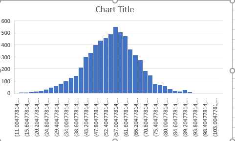
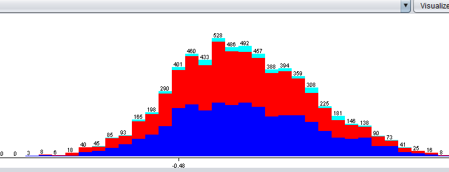

```{r, results="hide", message=FALSE, warning=FALSE, fig.show="hide"}
library(plotly)
library(RSQLite)
```

# Rough feature annotation

Ok, so here we can start annotating the genes. Right away we can see 3 rough regions:

* 'Hat' genes that form this separate domain (z > 175)
* "Internal" and "External" genes: the rest of the genes form a bubble. separate into internal and external.

Centroid of the "bubble": 108.823, 71.102, 81.404

SELECT Gene, sqrt((x - 108.823) * (x - 108.823) + (y - 71.102) * (y - 71.102) + (z - 81.404) * (z - 81.404)) AS Radioid FROM Loci WHERE z < 175

It turns out that the bubble is empty:



Nevertheless, we can still consider bubble "internal" and "external" genes as ones that face inwards and outwards of the bubble. Average distance from the centroid is: 56.148

```{sqlite}
CREATE TABLE Labels AS 
SELECT Gene, 
CASE
	WHEN z > 175 THEN "Hat"
	ELSE CASE
		WHEN (x - 108.823) * (x - 108.823) + (y - 71.102) * (y - 71.102) + (z - 81.404) * (z - 81.404) > 3152.644 THEN "External"
		ELSE "Internal"
	END
END Label
FROM Loci
```

# Load and visualize the labels

```{r, message=FALSE, warning=FALSE}
conn <- dbConnect(RSQLite::SQLite(), "../../Results/yeast.sqlite")
genePositionsLabels <- dbGetQuery(conn, "SELECT Loci.Gene, x, y, z, Label FROM
Loci JOIN RoughFeatures ON Loci.Gene = RoughFeatures.Gene")
plot_ly(x=genePositionsLabels$x, y=genePositionsLabels$y, z=genePositionsLabels$z, type="scatter3d", mode="markers", text=genePositionsLabels$Gene, color=genePositionsLabels$Label)
dbDisconnect(conn)
```
## Takeaway

Histone modifications are agnostic to our structural domain labels.



