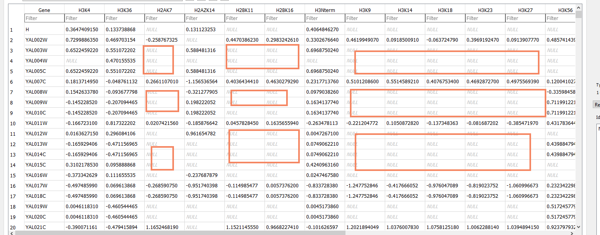
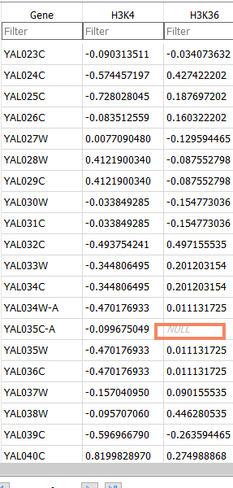
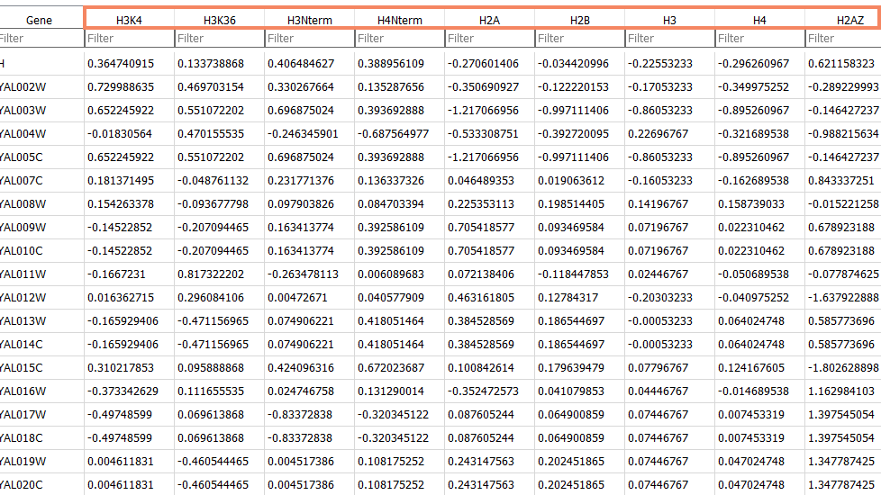

```{r, results="hide", message=FALSE, warning=FALSE, fig.show="hide", echo=FALSE}
library(plotly)
library(RSQLite)
```

# Preprocessing of histone signals

## Original data

The input file consists of rows, each beginning with a gene name and followed by tab-separated real numbers forming the columns. Each column corresponds to a histone modification.

The numbers are in z-score across all columns.

A lot of cells have missing values. I think this means "no reads" or just a few reads. Need to clarify this.

Citation required here: what is the origin of the file?

## Selection of histone modifications

During visual inspection of the input file, we notice that a lot of the columns are too sparse.



Regardless of the way we will choose to handle these gaps, we would need to introduce some assumption and noise to our data. Se we decided to not take these histone modifications into consideration.

We have thus selected the following histone modifications to work with:

 * H3K4
 * H3K6
 * H3NTerm
 * H4NTerm
 * H2A
 * H2B
 * H3
 * H4
 * H2AZ

These still have occassional missing values.



## Patching the missing values

Consider each gene as a vector of 9 dimensions.
We patch the missing value using the following rule:
 * Find the 3 closest vectors (Euclidean distance) which happen to have the value populated.
 * Use the median of the 3.
 
The advantages of this method are:

 * We don't introduce arbitrary values.
 * Patching takes into account the entire data set.
 * Continuity in one- or three-dimensional space is preserved.
 
Patched data:

