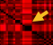

```{r, results="hide", message=FALSE, warning=FALSE, fig.show="hide", echo=FALSE}
library(gplots)
library(plotly)
library(RSQLite)
library(RColorBrewer)
```

# Histone distance maps

## Distance maps

We visualize the distance (as a heatmap), between each gene and every other gene.


```{r, warning=FALSE, echo=FALSE}
colors <- c("#000000", "#FF0000", "#FF00FF")
colors <- colorRampPalette(colors)(25)

# Keep a table of genes and their 'uniqueness' value
uniqueness <- c()

plotChromosome <- function(chromosome) {
	# Prepare SQL to get data from a single chromosome
	whereClause <- paste("WHERE Chromosome = ", chromosome)
	sql <- paste("SELECT h.* FROM HistonesPromoterPatched h JOIN Loci ON h.Gene = Loci.Gene ", whereClause, " ORDER BY Chromosome, Start")

	# Get data
	conn <- dbConnect(RSQLite::SQLite(), "../../Results/yeast.sqlite")
	histones <- dbGetQuery(conn, sql)
	row.names(histones) <- histones$Gene
	histones <- histones[,names(histones) != "Gene"]
	dbDisconnect(conn)

	# Plot
	distanceMatrix <- dist(histones)
	distanceMatrix <- as.matrix(distanceMatrix)
	title <- paste("Chromosome ", chromosome)
	heatmap.2(distanceMatrix, main=title, dendrogram='none', Rowv=FALSE, Colv=FALSE,trace='none', col=colors)
}

#for (chromosome in 1:16) {
#	plotChromosome(chromosome)
#}

plotChromosome(3)

```

All chromosomes yield a similar picture.

## Evaluating the distance maps

The black diagonal corresponds to a zero distance (all genes have a zero distance to themselves).

The first thing one notices in these pictures are the distinct red parallel lines (horizontal and vertical). A red line marks a gene with a particular histone profile, which is relatively unique (it differs from all other genes), thus the distance from all the other genes is significant.

The interesting thing though is that we get these unique profiles in clusters in the linear chromosome. This manifests as a black rectangle in the intersection of two thick red lines:



## Histone communities

We will call these local groups "Histone communities", as they consist of genes with similar and unique histone modifications that converge together in space.


