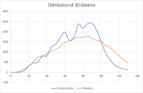

```{r, results="hide", message=FALSE, warning=FALSE, fig.show="hide", echo=FALSE}
library(gplots)
library(plotly)
library(RSQLite)
library(RColorBrewer)
library(clusternor)
```

# Histone communities

## Community score

We have calculated the "community score" for each gene.

The score is defined as: A / N, where: 

* A is the average Euclidean distance (in histone space) from the gene to all other genes of the same chromosome.
* N is the average distance of the genes of the local group of 5 genes (+/- 2 genes from the genes we are examining).

We bias the denominator to be 0.17 as a minimum. This corresponds to average of all N minus 3 standard deviations, so as to prevent divisions by zero. The 3 major spikes that can be seen in the picture below are such instances.

```{r warning=FALSE, echo=FALSE}
# Read community scores
conn <- dbConnect(RSQLite::SQLite(), "../../Results/yeast.sqlite")
scores <- dbGetQuery(conn, "SELECT l.Gene, Score FROM Loci l JOIN CommunityScores s ON l.Gene = s.Gene ORDER BY Chromosome, Start")
row.names(scores) <- scores$Gene
#scores <- scores[,names(scores) != "Gene"]
dbDisconnect(conn)
ggplot(scores, aes(x=1:nrow(scores), y=Score)) +
  geom_line() + 
  xlab("Gene number (ordered by chromosome and start position)")

```

## Filtering by community score

We consider a value of '2' as significant. In other words, a gene being twice as similar as their neighbours than its similarity to all other genes in the chromosome is considered a "community center" gene.
Here is a hierarchical clustering of the histone modifications of community centers:

```{r warning=FALSE, echo=FALSE}
## Genes selected for being community-centers
sql <- "SELECT h.* FROM HistonesPromoterPatched h JOIN CommunityScores s ON h.Gene = s.Gene WHERE Score >= 2"
conn <- dbConnect(RSQLite::SQLite(), "../../Results/yeast.sqlite")
centers <- dbGetQuery(conn, sql)
row.names(centers) <- centers$Gene
centers <- centers[,names(centers) != "Gene"]
centers <- as.matrix(centers)
dbDisconnect(conn)

# Do heatmap
clusters <- heatmap.2(centers, main="Community centers", hclustfun=function(d) hclust(d, method="ward.D"))
clusters <- as.hclust(clusters$rowDendrogram)
```


# Deciding number of clusters

We have chosen the community center genes in such a way that we expect clear-cut clusters to be formed in histone space. Plotting the within-cluster total sum of squares we expect to see a clear-cut elbow.

```{r warning=FALSE, echo=FALSE}
maxClusterCount <- 10
withinSS <- sapply(1:maxClusterCount, 
              function(k){kmeans(centers, k, nstart=50,iter.max = 20 )$tot.withinss})
plot(1:maxClusterCount, withinSS,
     type="b", pch = 19, frame = FALSE, 
     xlab="Cluster count",
     ylab="Within-clusters total sum of squares")
 
```

## x-means

It is not easy to decide where the elbow is. I would say it is on 3 clusters, but there's a lot more variance to be explained below that.
Searching for a less ambiguous method, I stumbled upon x-means.

x-means clustering algorithm outputs not only the k clusters, but also k itself. It does so by optimizing an objective function - the Bayesian information criterion - which reveals the mosto likely k. Experiments by the authors have shown it to reveal the true model underlying the data.

```{r}
bicOptimizedClusters <- Xmeans(centers, kmax=10)
Cluster <- bicOptimizedClusters$cluster
centers <- cbind(centers, Cluster)
Cluster
bicOptimizedClusters$size
```
x-means comes up with k=7, which explains most of the variance. Beyond 7 clusters it is evudebt that there's not much to be gained.

Saving the community centers to database in CommunityCenters table, containing Gene name and Community (integer).


```{r results="hide", message=FALSE, warning=FALSE, fig.show="hide"}
# Insert community centers and corresponding cluster ids to db
conn <- dbConnect(RSQLite::SQLite(), "../../Results/yeast.sqlite")
dbExecute(conn, "DROP TABLE IF EXISTS CommunityCenters")
dbExecute(conn, "CREATE TABLE CommunityCenters(Gene TEXT PRIMARY KEY, Community INTEGER)")
for (i in 1:nrow(centers)) {
	sql <- paste("INSERT INTO CommunityCenters(Gene, Community) VALUES('", row.names(centers)[i], "',", centers[i, 10], ")", sep='')
	dbExecute(conn, sql)
}
dbDisconnect(conn)
```

## Community centers in 3D

In this plot we only see the community centers. Each dot represents a gene and implies a group of 5 genes around it, having a similar histone profile.

```{r echo=FALSE}
conn <- dbConnect(RSQLite::SQLite(), "../../Results/yeast.sqlite")
communities <- dbGetQuery(conn, "SELECT l.Gene, x, y, z, Community FROM CommunityCenters c JOIN Loci l ON c.Gene = l.Gene")
plot_ly(x=communities$x, y=communities$y, z=communities$z, type="scatter3d", mode="markers", text=communities$Gene, color=communities$Community)
dbDisconnect(conn)
```

Subsequently, we are going to classify the entire genome using these centers as a scaffold, in histone space.

## Communities in 3D

After classifying all genes using the above scaffold and knn algorithm (k=3), we can plot them in space.

Communities include a central histone-space cluster (aroung zero in all dimensions), which allows us to classify the entire set.
In other words, one of the "extremes" is actually the center of histone space, distant from all other community centers.

```{r echo=FALSE}
conn <- dbConnect(RSQLite::SQLite(), "../../Results/yeast.sqlite")
communities <- dbGetQuery(conn, "SELECT l.Gene, x, y, z, Community FROM Communities c JOIN Loci l ON c.Gene = l.Gene")
plot_ly(x=communities$x, y=communities$y, z=communities$z, type="scatter3d", mode="markers", text=communities$Gene, color=communities$Community)
dbDisconnect(conn)
```

## Communities in 1D

Here is how the communities look in the linear chromosome. Genes are displayed in succession where each gene has a width of 1 pixel:


## Measuring Shannon entropy

We sample windows of 25 consecutive genes and measure Shannon entropy. Then we sample "clouds" of 25 uniformly random genes (with replacement) and compare the distributions of entropy.


We used a total of 100000 random samples for both windows and clouds.

Unlike the "cloud" distribution which is normal, the "window" distribution differs both in shape and in its displacement towards smaller values.
Its multimodal shape hints a hierarchy of structure, starting from a set of very low-entropy windows (around 1.2 bits of entropy), two more less structured and more abundant sets at 1.5 and 1.7 bits and finally, after the average has been reached, the distribution collapses to normality.

Probably most interesting result is the first step of the staircase.
This corresponds to a set of windows having around 1.2 bits of entropy. These account for around 1% of the samples.

The entire bubble lies in an area of low (<0.001) p-value with respect to the cloud distribution. An entropy limit of 1.28 bits corresponds to that p-value. We can filter our windows based on that.

## Tight communities

Windows of 25 genes, filtered for a maximum of 1.28 bits of entropy.

### 2D view


### 3D view

```{r echo=FALSE}
conn <- dbConnect(RSQLite::SQLite(), "../../Results/yeast.sqlite")
tightCommunities <- dbGetQuery(conn, "SELECT Gene, x, y, z, CASE WHEN Gene IN (SELECT Gene FROM TightCommunities) THEN 'Tight' ELSE 'Random' END AS Tightness FROM Loci")
plot_ly(x=tightCommunities$x, y=tightCommunities$y, z=tightCommunities$z, type="scatter3d", mode="markers", text=tightCommunities$Gene, color=tightCommunities$Tightness, colors=c("#000000", "#FF0000"))
dbDisconnect(conn)
```

## Distance distribution

We now have sets of genes having both:

* Similar histone profiles, and
* Proximity in the linear chromosome

Does this imply proximity in 3D space?

To answer this, we measure the Euclidean distance in 3D space between "tight community" genes and between random pairs of genes.
To remove the advantage of the first group, which is that they are consecutive by definition, we only sample pairs from distinct chromosomes.



The resulting p-value is approximately 0.57.
Community genes do not appear to be correlated in 3D space. The multiple peaks are expected; each represents the interaction of a pair of communities.

## Resulting gene lists

Communities are named using a combination of the chromosome name and the optional suffix of -A or -B, which signifies the first or second cluster found in given chromosome. A given chromosome may contain zero, one or two clusters.

### II
YBR203W YBR204C YBR205W YBR206W YBR207W YBR208C YBR209W YBR210W YBR211C YBR212W YBR213W YBR214W YBR215W YBR216C YBR217W YBR218C YBR219C YBR220C YBR221C YBR222C YBR223C YBR225W YBR226C YBR227C YBR228W YBR229C YBR230C YBR231C YBR232C YBR233W YBR234C YBR235W YBR236C YBR237W

### IV-A
YDL013W YDL012C YDL011C YDL010W YDL009C YDL008W YDL007W YDL006W YDL005C YDL004W YDL003W YDL002C YDL001W YDR001C YDR002W YDR003W YDR004W YDR005C YDR006C YDR007W YDR008C YDR009W YDR010C YDR011W YDR012W YDR013W YDR014W YDR015C YDR016C YDR017C YDR018C YDR019C

### IV-B
YDR078C YDR079W YDR080W YDR081C YDR082W YDR083W YDR084C YDR085C YDR086C YDR087C YDR088C YDR089W YDR090C YDR091C YDR092W YDR093W YDR094W YDR095C YDR096W YDR097C YDR098C YDR099W YDR100W YDR101C YDR102C YDR103W YDR104C YDR105C YDR106W

### VII-A
YGL110C YGL109W YGL108C YGL107C YGL106W YGL105W YGL104C YGL103W YGL102C YGL101W YGL100W YGL099W YGL098W YGL097W YGL096W YGL095C YGL094C YGL093W YGL092W YGL091C YGL090W YGL089C YGL088W YGL087C YGL086W YGL085W YGL084C YGL083W YGL082W YGL081W YGL080W YGL079W YGL078C YGL077C YGL076C YGL075C YGL074C YGL073W YGL072C YGL071W

### VII-B
YGL004C YGL003C YGL002W YGL001C YGR001C YGR002C YGR003W YGR004W YGR005C YGR006W YGR007W YGR008C YGR009C YGR010W YGR011W YGR012W YGR013W YGR014W YGR015C YGR016W YGR017W YGR018C YGR019W YGR020C YGR021W

### X
YJR003C YJR004C YJR005W YJR006W YJR007W YJR008W YJR009C YJR010W YJR011C YJR012C YJR013W YJR014W YJR015W YJR016C YJR017C YJR018W YJR019C YJR020W YJR021C YJR022W YJR023C YJR024C YJR025C YJR026W YJR027W YJR029W YJR028W YJR030C YJR031C YJR032W YJR033C YJR034W YJR035W YJR036C YJR037W YJR038C YJR039W YJR040W YJR041C YJR042W YJR043C YJR044C YJR045C YJR046W YJR047C YJR048W YJR049C YJR050W YJR051W YJR052W YJR053W YJR054W YJR055W YJR056C YJR057W

### XI-A
YKL145W YKL144C YKL143W YKL142W YKL141W YKL140W YKL139W YKL138C YKL137W YKL136W YKL135C YKL134C YKL133C YKL132C YKL131W YKL130C YKL129C YKL128C YKL127W YKL126W YKL125W YKL124W YKL123W YKL122C YKL121W

### XI-B
YKR010C YKR011C YKR012C YKR013W YKR014C YKR015C YKR016W YKR017C YKR018C YKR019C YKR020W YKR021W YKR022C YKR023W YKR024C YKR025W YKR026C YKR027W YKR028W YKR029C YKR030W YKR031C YKR032W YKR033C YKR034W YKR035C YKR036C YKR037C YKR038C YKR039W YKR040C YKR041W

### XIII
YML122C YML121W YML120C YML119W YML118W YML117W YML116W YML115C YML114C YML113W YML112W YML111W YML110C YML109W YML108W YML107C YML106W YML105C YML104C YML103C YML102W YML101C YML100W YML099C YML098W YML097C YML096W YML095C YML094W YML093W YML092C YML091C YML090W YML089C YML088W YML087C YML086C

### XIV-A
YNL177C YNL176C YNL175C YNL174W YNL173C YNL172W YNL171C YNL170W YNL169C YNL168C YNL167C YNL166C YNL165W YNL164C YNL163C YNL162W YNL161W YNL160W YNL159C YNL158W YNL157W YNL156C YNL155W YNL154C YNL153C YNL152W YNL151C YNL150W YNL149C YNL148C YNL147W YNL146W YNL145W YNL144C YNL143C YNL142W YNL141W YNL140C YNL139C YNL138W YNL137C YNL136W YNL135C

### XIV-B
YNL064C YNL063W YNL062C YNL061W YNL059C YNL058C YNL057W YNL056W YNL055C YNL054W YNL053W YNL052W YNL051W YNL050C YNL049C YNL048W YNL047C YNL046W YNL045W YNL044W YNL043C YNL042W YNL041C YNL040W YNL039W

### XVI
YPR041W YPR042C YPR043W YPR044C YPR045C YPR046W YPR047W YPR048W YPR049C YPR050C YPR051W YPR052C YPR053C YPR054W YPR055W YPR056W YPR057W YPR058W YPR059C YPR060C YPR061C YPR062W YPR063C YPR064W YPR065W YPR066W YPR067W YPR068C YPR069C YPR070W

## Gene enrichments

Our criteria for inclusion of g:profiler results are:

* An adjusted p-value that is less than 1%, or
* An adjusted p-value that is less than 5% and more than 5 genes

| Community		| Term												|
|---------------|---------------------------------------------------|
| II			| acetyl-CoA transmembrane transporter activity		|
| IV-A			| Factor: Gal4p, Factor: Gal4p, Factor: SWI4P		|
| IV-B			| 													|
| VII-A			| 													|
| VII-B			| Factor: DAL81										|
| X				| Factor: Mbp1p, Factor: ARG						|
| XI-A			| 													|
| XI-B			| 													|
| XIII			| 													|
| XIV-A			| 													|
| XIV-B			| 													|
| XVI			| 													|

