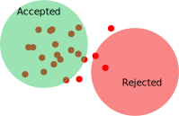
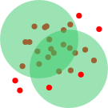

```{r, results="hide", message=FALSE, warning=FALSE, fig.show="hide", echo=FALSE}
library(plotly)
library(RSQLite)
```

# Sphere test

We shall now describe a generic framework which was utilized throughout the rest of this work, to segment the three-dimensional genome into areas of interest regarding certain local properties of genes and chromatin in general.
We will refer to this framework as a "sphere test".

## Sphere sampling

We sample sets of genes using randomly placed spheres of a given radius. A commonly used value for the radius is 15 units. This allows for sampling sets of up to approximately 150 genes.
We then set a minimum acceptable size for a sample. Usually this is set to 50 genes. We do so to ensure that our calculations will be performed on a gene set of suitable size to do statistics upon.



## Gene and chromatin signal statistics

We then calculate a given metric on each set of sampled genes. Properties like histone modification frequencies, presence or absence of transcription factor binding motifs, gene coexpression scores et cetera -collectively referred to as "signals"- are used as inputs to measure a statistical property of the local set of genes collected by each sphere.

## Monte-Carlo estimation of a p-value

We then proceed to calculate the same metric for random sets of genes, having the same gene count as the sphere-sample. We calculate a p-value as the ratio of random occurrences that are equal or more extreme to the metric produced by the sphere.
Afterwards, we adjust the p-values by applying the Benjamini-Hochberg method.

## Filtering by adjusted p-value

We set a limit for the adjusted p-value, usually 1% and filter the sphere-samples below this limit. These sphere-samples are then considered to exhibit a significantly localized aspect of the signal.

## Hierarchical clustering of the significant spheres

The resulting sets of genes frequently overlap. We consider overlapping samples as belonging to the same local set of genes. A limit of a minimum 5% overlap is applied. Sets connected with less than 5% of their genes are considered distinct.

We use an iterative approach to clustering. It can be summarized as follows:

* Identify the pair of clusters that overlaps the most.
* Merge this pair into a new cluster.
* Repeat until we reach the 5% limit, at which point we stop.



## Sphere-test data flow diagram


# Histone-space proximity sphere-test

Our first sphere-test measures proximity in histone-space. Histone-space is a 9-dimensional space, where each dimension corresponds to one of our selected promoter-site histone modifications. A point in that space corresponds to a particular histone modification profile.

The metric for this test is the average distance in histone space, defined as follows.

Given a set of genes G, we denote as P the set of all possible unordered pairs of G. A histone distance is defined for a pair as the Euclidean distance in histone-space for the two genes of the pair. Then, the average histone distance in P is our metric for this particular sphere-test.

It follows that, a set of genes scoring low in this metric contains a more consistent histone modification profile than one scoring higher.

We employ a FDR of 1% to determine statistically significant samples, and this result in seven distinct (zero overlaps) local clusters of very coherent histone modification profiles. Total gene count is approximately 1000, which roughly represents 1/6th of the yeast genome.

```{r, message=FALSE, warning=FALSE}
sql <- "SELECT l.*, CASE WHEN Field IS NULL THEN 'None' ELSE Field END AS Field FROM Loci l LEFT JOIN PromoterFields f ON l.Gene = f.Gene"
fieldColors <- c("#FF0000", "#00FF00", "#0000FF", "#FFFF00", "#00FFFF", "#4488AA", "#FF00FF", "#000000")
conn <- dbConnect(RSQLite::SQLite(), "../../Results/yeast.sqlite")
promoterFields <- dbGetQuery(conn, sql)
plot_ly(x=promoterFields$x, y=promoterFields$y, z=promoterFields$z, type="scatter3d", mode="markers", text=promoterFields$Gene, color=promoterFields$Field, colors=fieldColors)
dbDisconnect(conn)
```

## Internal vs external

Promoter fields pepetrate deep into the nucleus, thus not differentiating between "Internal" and "External" rough features:

```{r, message=FALSE, warning=FALSE}
sql <- "SELECT l.*, CASE WHEN Field IS NULL THEN 'None' ELSE Field END AS Field FROM Loci l LEFT JOIN PromoterFields f ON l.Gene = f.Gene WHERE l.Gene IN (SELECT Gene FROM RoughFeatures WHERE Label='Internal')"
fieldColors <- c("#FF0000", "#00FF00", "#0000FF", "#FFFF00", "#00FFFF", "#4488AA", "#FF00FF", "#000000")
conn <- dbConnect(RSQLite::SQLite(), "../../Results/yeast.sqlite")
promoterFields <- dbGetQuery(conn, sql)
plot_ly(x=promoterFields$x, y=promoterFields$y, z=promoterFields$z, type="scatter3d", mode="markers", text=promoterFields$Gene, color=promoterFields$Field, colors=fieldColors)
dbDisconnect(conn)
```
