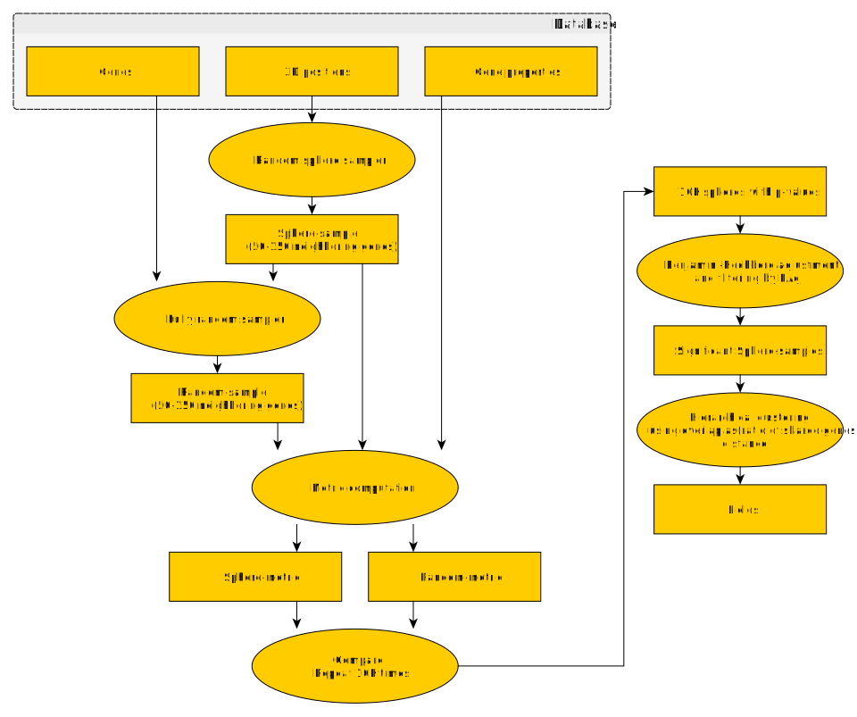
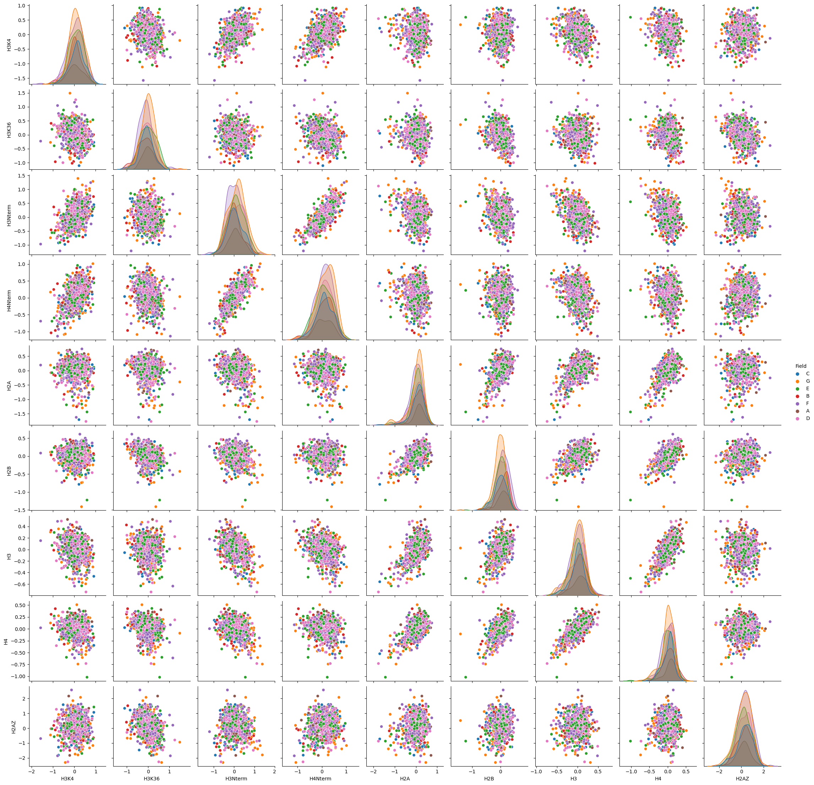

```{r, results="hide", message=FALSE, warning=FALSE, fig.show="hide", echo=FALSE}
library(ggplot2)
library(plotly)
library(RSQLite)
library(reticulate)
library(gplots)
library(RColorBrewer)
```

# Sphere test

We shall now describe a generic framework which was utilized throughout the rest of this work, to segment the three-dimensional genome into areas of interest regarding certain local properties of genes and chromatin in general.
We will refer to this framework as a "sphere test".

## Sphere sampling

We sample sets of genes using randomly placed spheres of a given radius. A commonly used value for the radius is 15 units. This allows for sampling sets of up to approximately 150 genes.
We then set a minimum acceptable size for a sample. Usually this is set to 50 genes. We do so to ensure that our calculations will be performed on a gene set of suitable size to do statistics upon.


## Gene and chromatin signal statistics

We then calculate a given metric on each set of sampled genes. Properties like histone modification frequencies, presence or absence of transcription factor binding motifs, gene coexpression scores et cetera -collectively referred to as "signals"- are used as inputs to measure a statistical property of the local set of genes collected by each sphere.

## Monte-Carlo estimation of a p-value

We then proceed to calculate the same metric for random sets of genes, having the same gene count as the sphere-sample. We calculate a p-value as the ratio of random occurrences that are equal or more extreme to the metric produced by the sphere.
Afterwards, we adjust the p-values by applying the Benjamini-Hochberg method.

## Filtering by adjusted p-value

We set a limit for the adjusted p-value, usually 1% and filter the sphere-samples below this limit. These sphere-samples are then considered to exhibit a significantly localized aspect of the signal.

## Hierarchical clustering of the significant spheres

The resulting sets of genes frequently overlap. We consider overlapping samples as belonging to the same local set of genes. A limit of a minimum 5% overlap is applied. Sets connected with less than 5% of their genes are considered distinct.

We use an iterative approach to clustering. It can be summarized as follows:

* Identify the pair of clusters that overlaps the most.
* Merge this pair into a new cluster.
* Repeat until we reach the 5% limit, at which point we stop.


## Sphere-test data flow diagram



# Histone-space proximity sphere-test

Our first sphere-test measures proximity in histone-space. Histone-space is a 9-dimensional space, where each dimension corresponds to one of our selected promoter-site histone modifications. A point in that space corresponds to a particular histone modification profile.

The metric for this test is the average distance in histone space, defined as follows.

Given a set of genes G, we denote as P the set of all possible unordered pairs of G. A histone distance is defined for a pair as the Euclidean distance in histone-space for the two genes of the pair. Then, the average histone distance in P is our metric for this particular sphere-test.

It follows that, a set of genes scoring low in this metric contains a more consistent histone modification profile than one scoring higher.

We employ a FDR of 1% to determine statistically significant samples, and this result in seven distinct (zero overlaps) local clusters of very coherent histone modification profiles. Total gene count is approximately 1000, which roughly represents 1/6th of the yeast genome.

```{r, message=FALSE, warning=FALSE}
sql <- "SELECT l.*, CASE WHEN Field IS NULL THEN 'None' ELSE Field END AS Field FROM Loci l LEFT JOIN PromoterFields f ON l.Gene = f.Gene"
fieldColors <- c("#FF0000", "#00FF00", "#0000FF", "#FFFF00", "#00FFFF", "#4488AA", "#FF00FF", "#000000")
conn <- dbConnect(RSQLite::SQLite(), "../../Results/yeast.sqlite")
promoterFields <- dbGetQuery(conn, sql)
plot_ly(x=promoterFields$x, y=promoterFields$y, z=promoterFields$z, type="scatter3d", mode="markers", text=promoterFields$Gene, color=promoterFields$Field, colors=fieldColors)
dbDisconnect(conn)
```

## Internal vs external

Promoter fields pepetrate deep into the nucleus, thus not differentiating between "Internal" and "External" rough features:

```{r, message=FALSE, warning=FALSE}
sql <- "SELECT l.*, CASE WHEN Field IS NULL THEN 'None' ELSE Field END AS Field FROM Loci l LEFT JOIN PromoterFields f ON l.Gene = f.Gene WHERE l.Gene IN (SELECT Gene FROM RoughFeatures WHERE Label='Internal')"
fieldColors <- c("#FF0000", "#00FF00", "#0000FF", "#FFFF00", "#00FFFF", "#4488AA", "#FF00FF", "#000000")
conn <- dbConnect(RSQLite::SQLite(), "../../Results/yeast.sqlite")
promoterFields <- dbGetQuery(conn, sql)
plot_ly(x=promoterFields$x, y=promoterFields$y, z=promoterFields$z, type="scatter3d", mode="markers", text=promoterFields$Gene, color=promoterFields$Field, colors=fieldColors)
dbDisconnect(conn)
```

## Histone profiles

We then attempt a pair plot of all 9 histone modifications and their associated classes.

```

# Disabling because this takes a long time to produce. Add ```{r} to enable again.

conn <- dbConnect(RSQLite::SQLite(), "../../Results/yeast.sqlite")
histoneProfiles <- dbGetQuery(conn, "SELECT H3K4, H3K36, H3NTerm, H4NTerm, H2A, H2B, H3, H4, H2AZ, Field FROM HistonesPromoterPatched h JOIN PromoterFields p ON h.Gene = p.Gene")
dbDisconnect(conn)


use_python('C:\\Users\\ProteinMetrics\\AppData\\Local\\Programs\\Python\\Python38\\python.exe')
sns <- import('seaborn')
plt <- import('matplotlib.pyplot')
pd <- import('pandas')

plot <- sns$pairplot(r_to_py(histoneProfiles), hue = 'Field')
plot$savefig("images/PromoterFieldsHistonePairPlot.png")

```


Calling the histone profiles by absolute value is not possible. All distributions are almost identical to the overall histone modification distribution.

What differs, however, is a gentle displacement of the average in each dimension. The distinguishing characteristic of our clusters is the accumulation of such tendencies in multiple dimensions. This lowers the average histone profile distance to statistically significant levels.

The natural way to represent our data is therefore a quantification of the gentle shifts for each cluster.

For each histone modification, we calculate the average of each group. Then we consider the distribution of the averages and assign a z-score to each group. The 9-vector of z-scores will then characterize the collective tendencies of the group.

```{r}
#colors <- c("#FF0000", "#FF0000", "#000000", "#00FF00", "#00FF00")
#colors <- colorRampPalette(colors)(25)
colors <- brewer.pal(256, "YlGnBu")

tendencies <- read.table(
  "../../Results/PromoterFieldsTendencies.tsv",
  sep="\t", header=TRUE, row.names=1)
tendenciesScaled <- scale(tendencies)
heatmap.2(tendenciesScaled, col=colors)
```

Observations:

* Every cluster occupies its own spot in the space of possible tendencies.
* The histogram drawn over the color key verifies the deviation behavior. The distribution is bimodal. 
* The 2 smaller clusters (A and B) are similar: they overrepresent H2A, H2B, H3 and H4.
* The largest cluster, G, is roughly antithetical to the smaller ones (A and B)

The table below summarizes the more prominent tendencies for Over- and Under-representation observed in each cluster:

|   | Over             | Under                |
|---|------------------|----------------------|
| A | H3K36, H3, H4    |                      |
| B | H2A, H2B         | H3K4, H3K36, H3NTerm |
| C | H3K4             |                      |
| D | (H3NTerm)        | (H2A)                |
| E |                  | H4NTerm, H3, H2AZ    |
| F | H2AZ             | H2A                  |
| G | H3NTerm, H4NTerm | H2B, H4              |

Tendencies of cluster D have been parenthesized, to show that these are not most dominant among the group. Rest of the table contains most dominant tendencies per histone variant.

## Discussion

What makes the clusters statistically significant is not a substantial shift in histone modification profiles. It is a subtle tendency towards over- or under-representation of each histone variant. Statistical significance is therefore explained by the entire gene group's decision to move towards one or the other side.
We didn't select the groups for this. The statistical test was histone-space compactness. Thus, the groups must be of reduced variance. Let's add a figure to illustrate that.

## Gene ontology enrichment

Only the larger clusters produce enriched terms:

|   | Term                                | PAdj |
|---|-------------------------------------|------|
| D | Terpenoid backbone biosynthesis     | 4%   |
| E | Ribosomal small subunit binding     | 5%   |
| F | Factor: HSF; motif: AGAANAGAANAGAAN | 2%   |
| G | Factor: HSF; motif: NTTCTAGAANAGAAN | 1%   |

