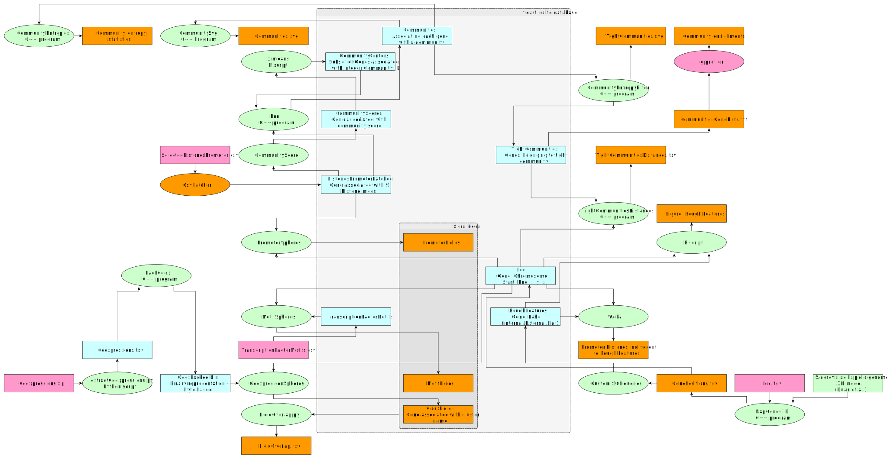

# Technical

The following diagram summarizes the flow of data, beginning from our inputs (signals) and ending at results.

* Data items are visualized as boxes
* Software is visualized as ellipses.
* Data passing through software is transformed into new data (boxes).

This image may serve as a guide for reproducing parts of this work. The associated SVG file can be found in r/Chapters/images/FromSourcesToResults.svg and conveniently zoomed at. Also the source graph project is available in Diagrams folder (FromSourcesToResults.graphml).

## Database

The light gray frame in the picture above represents the database. We use a single sqlite file as a central data structure. Various scripts and programs, independent from one another, perform the required transformations. This structure makes it easy to add components at will, with the sole requirement that each component respects the central data structure. This provides for a much cleaner namespace. For instance, all of our programs that do sphere tests, define a "Gene" class. Each time the class has different members (histones, TFs etc) and is loaded from different combinations of tables. This lets each particular program to solely focus on the task at hand and avoids complicated data structures and naming schemes. At the same time, all available data is accessible by all programs.